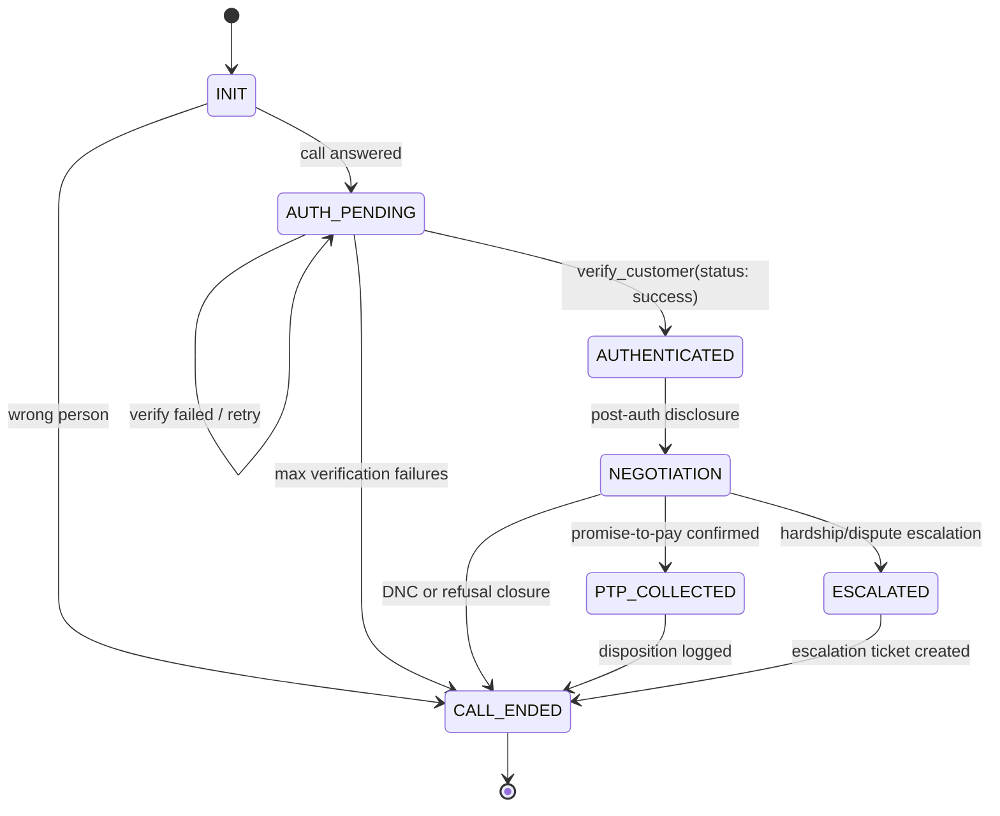
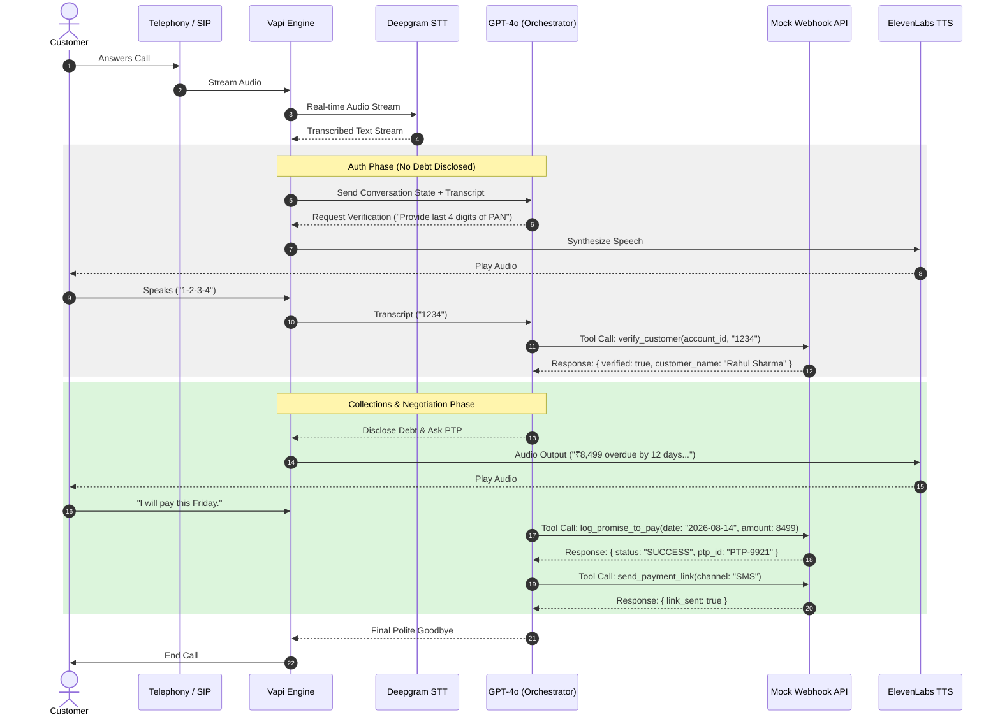

# Kapture Collections Voicebot (Maya) - High-Level Design

## 1. Pipeline & Latency Budget

Maya is an outbound collections voice agent orchestrated through Vapi. The real-time path is:

Telephony (SIP/PSTN) -> STT (Deepgram Nova-2) -> Orchestrator/LLM (GPT-4o) -> TTS (ElevenLabs/Cartesia) -> Telephony Output

The target is sub-1.2s turn latency for a natural call experience while retaining compliance checks.

| Hop | Component | Target Latency (ms) | Timeout Threshold (ms) | Fallback Behavior |
|---|---|---:|---:|---|
| 1 | Telephony ingress + stream transport | 120 | 250 | Retry media channel once; if persistent jitter, continue with concise prompts |
| 2 | STT decode (Deepgram Nova-2) | 200 | 350 | Ask customer to repeat once; if repeated miss, switch to digit-by-digit capture |
| 3 | LLM orchestration first byte (GPT-4o) | 400 | 650 | Return short safe holding line and re-issue request with reduced context |
| 4 | TTS synthesis (ElevenLabs/Cartesia) | 300 | 500 | Fall back to shorter template utterance |
| 5 | Egress network/playback overhead | 180 | 300 | Continue call with shorter sentence chunks |
|  | **Total budget** | **1200** |  |  |

Timeout handling policy:
- STT timeout: one re-prompt is allowed; repeated failure moves toward no-input policy.
- LLM timeout: assistant uses a safe filler line and retries with compressed context while preserving state.
- Tool timeout: assistant says it is checking the account and retries once; if still failing, escalates with disposition `TECHNICAL_FAILURE`.
- TTS timeout: use short fallback utterance and avoid long generated responses.

## 2. State Machine

Conversation state is explicit and persisted per call.

Defined states:
- `INIT`
- `AUTH_PENDING`
- `AUTHENTICATED`
- `NEGOTIATION`
- `PTP_COLLECTED`
- `ESCALATED`
- `CALL_ENDED`

Critical gate:
- Transition from `AUTH_PENDING` to `AUTHENTICATED` is strictly locked behind a successful `verify_customer(status: success)` tool response.
- No intent classification, confidence score, or user claim can unlock this state without that tool result.

### State Transition Table

| Current State | Trigger | Condition | Next State | Action |
|---|---|---|---|---|
| `INIT` | Call answered | Customer present | `AUTH_PENDING` | Greeting, identity request without debt disclosure |
| `INIT` | Wrong person detected | Customer denies identity | `CALL_ENDED` | Mark `WRONG_PERSON`, polite closure |
| `AUTH_PENDING` | Verification tool response | `verify_customer.status = success` | `AUTHENTICATED` | Acknowledge verification |
| `AUTH_PENDING` | Verification tool response | `verify_customer.status = failed` and attempts < max | `AUTH_PENDING` | Re-prompt verification |
| `AUTH_PENDING` | Verification attempts exhausted | attempts >= max | `CALL_ENDED` | Mark `AUTH_FAILED`, terminate politely |
| `AUTHENTICATED` | Debt disclosure complete | N/A | `NEGOTIATION` | Ask for payment plan/PTP |
| `NEGOTIATION` | PTP accepted | Valid date and amount captured | `PTP_COLLECTED` | Call `log_promise_to_pay`, optionally `send_payment_link` |
| `NEGOTIATION` | Hardship or dispute | Escalation required | `ESCALATED` | Call `escalate_to_agent` |
| `NEGOTIATION` | DNC request | Immediate opt-out | `CALL_ENDED` | Call `mark_disposition(DNC_REQUESTED)` |
| `PTP_COLLECTED` | Closing completed | N/A | `CALL_ENDED` | Call `mark_disposition(PTP_COMMITTED)` |
| `ESCALATED` | Transfer ticket generated | N/A | `CALL_ENDED` | Confirm next steps, end call |

### Mermaid State Diagram



## 3. Intents & Entities Table

| Intent | Description | Example Utterances | Entities Extracted |
|---|---|---|---|
| `Confirm_Identity` | Customer confirms identity and verification data | "Yes, this is Rahul." / "Last four are 1234." | `Verification_Code` |
| `Promise_To_Pay` | Customer commits to payment | "I will pay on Friday." / "I can pay 5000 today." | `PTP_Date`, `PTP_Amount` |
| `Hardship_Claim` | Customer reports financial hardship | "I lost my job." / "I need a reduced installment." | `Hardship_Reason` |
| `Dispute_Debt` | Customer disputes amount or ownership | "This amount is incorrect." / "This is not my loan." | `Hardship_Reason` (as dispute note) |
| `Already_Paid` | Customer claims payment already completed | "I paid yesterday." / "Amount is already cleared." | `PTP_Date` (optional payment date) |
| `Request_DNC` | Customer requests no further calls | "Do not call me again." / "Put me on DNC." | None |
| `Wrong_Person` | Callee is not target customer | "You reached the wrong person." / "Rahul does not use this number." | None |

Entity formats:
- `PTP_Date`: ISO-8601 date, e.g. `2026-08-14`
- `PTP_Amount`: numeric, e.g. `8499`
- `Hardship_Reason`: free text string
- `Verification_Code`: short string, usually 4 digits

## 4. Tool / API Specifications

Webhook endpoint accepts tool calls and returns results in Vapi-compatible format.

### Common Envelope

Request envelope:

```json
{
  "message": {
    "type": "tool-calls",
    "toolCalls": [
      {
        "id": "call_123",
        "function": {
          "name": "verify_customer",
          "arguments": "{\"account_id\":\"ACC-88392\",\"verification_code\":\"1234\"}"
        }
      }
    ]
  }
}
```

Response envelope:

```json
{
  "results": [
    {
      "toolCallId": "call_123",
      "result": {
        "status": "success"
      }
    }
  ]
}
```

### `verify_customer`

Purpose: Validate customer identity before any debt disclosure.

Request schema:

```json
{
  "type": "object",
  "required": ["account_id", "verification_code"],
  "properties": {
    "account_id": { "type": "string" },
    "verification_code": { "type": "string" }
  }
}
```

Response schema:

```json
{
  "type": "object",
  "required": ["status", "verified"],
  "properties": {
    "status": { "type": "string", "enum": ["success", "failed"] },
    "verified": { "type": "boolean" },
    "customer_name": { "type": "string" },
    "attempts_remaining": { "type": "integer" }
  }
}
```

Example request:

```json
{
  "account_id": "ACC-88392",
  "verification_code": "1234"
}
```

Example response:

```json
{
  "status": "success",
  "verified": true,
  "customer_name": "Rahul Sharma",
  "account_id": "ACC-88392"
}
```

### `log_promise_to_pay`

Purpose: Record promise-to-pay commitment.

Request schema:

```json
{
  "type": "object",
  "required": ["account_id", "ptp_date", "ptp_amount"],
  "properties": {
    "account_id": { "type": "string" },
    "ptp_date": { "type": "string", "format": "date" },
    "ptp_amount": { "type": "number", "minimum": 1 },
    "notes": { "type": "string" }
  }
}
```

Response schema:

```json
{
  "type": "object",
  "required": ["status", "ptp_id"],
  "properties": {
    "status": { "type": "string", "enum": ["SUCCESS", "FAILED"] },
    "ptp_id": { "type": "string" },
    "recorded_at": { "type": "string", "format": "date-time" }
  }
}
```

Example request:

```json
{
  "account_id": "ACC-88392",
  "ptp_date": "2026-08-14",
  "ptp_amount": 8499,
  "notes": "Customer agreed to pay by Friday"
}
```

Example response:

```json
{
  "status": "SUCCESS",
  "ptp_id": "PTP-9921",
  "recorded_at": "2026-08-13T11:22:30.000Z"
}
```

### `send_payment_link`

Purpose: Send payment URL via customer-selected channel.

Request schema:

```json
{
  "type": "object",
  "required": ["account_id", "channel"],
  "properties": {
    "account_id": { "type": "string" },
    "channel": { "type": "string", "enum": ["SMS", "WHATSAPP"] },
    "phone": { "type": "string" }
  }
}
```

Response schema:

```json
{
  "type": "object",
  "required": ["link_sent"],
  "properties": {
    "link_sent": { "type": "boolean" },
    "channel": { "type": "string" },
    "reference_id": { "type": "string" }
  }
}
```

Example request:

```json
{
  "account_id": "ACC-88392",
  "channel": "SMS",
  "phone": "+919999999999"
}
```

Example response:

```json
{
  "link_sent": true,
  "channel": "SMS",
  "reference_id": "PAY-1142"
}
```

### `escalate_to_agent`

Purpose: Route hardship/dispute calls to a human queue.

Request schema:

```json
{
  "type": "object",
  "required": ["account_id", "reason"],
  "properties": {
    "account_id": { "type": "string" },
    "reason": { "type": "string", "enum": ["HARDSHIP_REQUEST", "DISPUTE"] },
    "context": { "type": "string" }
  }
}
```

Response schema:

```json
{
  "type": "object",
  "required": ["status", "ticket_id"],
  "properties": {
    "status": { "type": "string", "enum": ["QUEUED", "FAILED"] },
    "ticket_id": { "type": "string" },
    "eta_minutes": { "type": "integer" }
  }
}
```

Example request:

```json
{
  "account_id": "ACC-88392",
  "reason": "HARDSHIP_REQUEST",
  "context": "Customer requests temporary restructuring"
}
```

Example response:

```json
{
  "status": "QUEUED",
  "ticket_id": "ESC-4102",
  "eta_minutes": 20
}
```

### `mark_disposition`

Purpose: Persist terminal call outcome.

Request schema:

```json
{
  "type": "object",
  "required": ["account_id", "disposition", "timestamp"],
  "properties": {
    "account_id": { "type": "string" },
    "disposition": {
      "type": "string",
      "enum": [
        "PTP_COMMITTED",
        "DNC_REQUESTED",
        "WRONG_PERSON",
        "NO_INPUT",
        "ABUSIVE_TERMINATED",
        "AUTH_FAILED",
        "DISPUTE_ESCALATED",
        "HARDSHIP_ESCALATED",
        "ALREADY_PAID_REVIEW",
        "CALL_DROPPED",
        "TECHNICAL_FAILURE"
      ]
    },
    "timestamp": { "type": "string", "format": "date-time" },
    "notes": { "type": "string" }
  }
}
```

Response schema:

```json
{
  "type": "object",
  "required": ["status", "logged_at"],
  "properties": {
    "status": { "type": "string", "enum": ["RECORDED"] },
    "logged_at": { "type": "string", "format": "date-time" }
  }
}
```

Example request:

```json
{
  "account_id": "ACC-88392",
  "disposition": "DNC_REQUESTED",
  "timestamp": "2026-08-13T11:28:00.000Z",
  "notes": "Customer requested immediate opt-out"
}
```

Example response:

```json
{
  "status": "RECORDED",
  "logged_at": "2026-08-13T11:28:01.000Z"
}
```

## 5. Auth & Data Safety Protocols

PII handling rules:
- Names in logs are masked to first token + initials pattern, e.g. `Rahul S****`.
- Account IDs are partially masked, e.g. `ACC-8***2`.
- Phone numbers are masked except country code and last two digits.
- Raw verification codes are never printed in full in server logs.

Pre-auth confidentiality rule:
- Terms such as "overdue", "loan", "EMI", "outstanding", or "Kapture Finance debt" must never be spoken before successful verification.

Enforcement design:
- Prompt-level enforcement: system prompt explicitly forbids debt-related disclosure in `STATE 0` and `STATE 1`.
- Orchestrator guardrail: before TTS output, run a lexical check for debt keywords if state is `INIT` or `AUTH_PENDING`; block response and replace with safe verification prompt.
- Server-side audit hook: optional webhook middleware can inspect assistant response metadata and emit `guardrail_violation` logs for post-call QA.

## 6. Compliance & Guardrails

RBI Fair Practices-aligned controls:
- Calling window: 08:00-19:00 local customer time only.
- Zero third-party disclosure: if non-customer answers, no debt context is shared.
- Immediate DNC compliance: capture request, mark disposition `DNC_REQUESTED`, and terminate politely.

Hallucination and offer controls:
- Agent cannot invent settlement waivers beyond approved policy.
- Maximum discretionary waiver discussed by voice agent is capped at 10%; anything above triggers escalation.
- Tool results are source of truth; assistant must wait for tool response before next action and never fabricate outcomes.

Disallowed behaviors:
- Threatening language, coercion, or harassment.
- Repetitive pressure tactics after explicit refusal.
- Misrepresentation of legal consequences.

## 7. Edge Cases Matrix

| Scenario | Detection Signal | Required Behavior | Disposition |
|---|---|---|---|
| Abusive user | Profanity/hostile language detected twice | Give one warning; on continuation perform soft hangup | `ABUSIVE_TERMINATED` |
| Silent user / voicemail | No response after two re-prompts | End call politely and stop retries | `NO_INPUT` |
| Mid-call language switch | User switches English/Hindi | Confirm preference and switch bilingual prompt style | context-dependent |
| Wrong person | Callee denies being Rahul Sharma | Do not disclose debt; apologize and end | `WRONG_PERSON` |
| Repeated failed verification | Invalid code >= 3 attempts | Stop authentication and close call | `AUTH_FAILED` |
| Call drop mid-negotiation | Telephony disconnect event | Save partial state and mark follow-up required | `CALL_DROPPED` |
| Already paid claim | User claims payment done | Acknowledge, mark review, offer receipt channel | `ALREADY_PAID_REVIEW` |
| Hardship requiring exception | User requests deferment/waiver beyond policy | Escalate to human collections specialist | `HARDSHIP_ESCALATED` |

## 8. Observability Metrics

Operational metrics tracked per campaign:

- Containment Rate

$$
\text{Containment Rate} = \frac{\text{calls resolved by Maya without human transfer}}{\text{total connected calls}}
$$

- PTP Rate

$$
\text{PTP Rate} = \frac{\text{calls with valid PTP}}{\text{total connected calls}}
$$

- First Call Resolution (FCR)

$$
\text{FCR} = \frac{\text{accounts resolved on first connected call}}{\text{total unique accounts connected}}
$$

Suggested per-call metrics event schema:

```json
{
  "event_type": "call_summary",
  "call_id": "vapi-call-001",
  "account_id_masked": "ACC-8***2",
  "start_time": "2026-08-13T11:20:00.000Z",
  "end_time": "2026-08-13T11:24:12.000Z",
  "call_duration_sec": 252,
  "final_state": "CALL_ENDED",
  "disposition": "PTP_COMMITTED",
  "verification_attempts": 1,
  "ptp_committed": true,
  "ptp_amount": 8499,
  "ptp_date": "2026-08-14",
  "escalated": false,
  "dnc_requested": false,
  "latency_ms": {
    "stt_p50": 190,
    "llm_first_byte_p50": 390,
    "tts_p50": 280
  }
}
```

---

## Architecture Flow Reference


